# Burger-Joints

This a fictional restaurant located beside New york city . The app is a restaurant management system designed to allow staff to easily manage the menus . It also provides customers with a simple,


![homepage]

### Site-Goals

The site is aimed to help restaurant staff to easily manage the menus displayed on the website, as well as keeping track of upcoming bookings and capacity, editing and deleting as neccessary. 

The site also aims to provide customers with a simple, hassle free way to make reservations without the need to call the restaurant. They will also be able to cancel their bookings or update when needed.

### Agile Planning

This project was developed using agile methodologies by delivering small features in incremental sprints. There were 3 sprints in total, spaced out evenly over four weeks.

All projects were assigned to epics, prioritized under the labels, Must have, should have, could have. They were assigned to sprints and story pointed according to complexity. "Must have" stories were completed first, "should haves" and then finally "could haves". It was done this way to ensure that all core requirements were completed first to give the project a complete feel, with the nice to have features being added should there be capacity.

The burger-joint2 board was created using github projects and can be located [here](https://github.com/users/Nikkeljohn/projects/12/views/1) and can be viewed to see more information on the project cards. All stories except the documentation tasks have a full set of acceptance criteria in order to define the functionality that marks that story as complete.

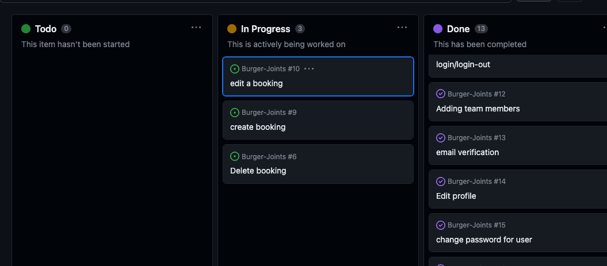

#### Epics

The project had 7 main Epics (milestones):

**EPIC 1 - Base Setup**

The base setup epic is for all stories needed for the base set up of the application. Without the base setup, the app would not be possible so it was the first epic to be delivered as all other features depend on the completion of the base setup.

**EPIC 2 - Contact/admins**

The contact/admin stories are related to all staff are able to from back end.

**EPIC 3 - Authentication Epic**

The authentication epic is for all stories related to the registration, login and authorization of views. This epic provides critical functionality and value as without it the staff would not be able to managed the bookings securely without regular site visitors also being able to see and perform actions.

**EPIC 4 - Menu**

The menu epic is for all stories that relate to the creating, deleting, editing and viewing of menus. This allows for  users to view menus and for staff to manage them from admin panel.

**EPIC 5 - Deployment Epic**

This epic is for all stories related to deploying the app to heroku so that the site is live for staff and customer use.

**EPIC 6 - Documentation**

This epic is for all document related stories and tasks that are needed to document the software development lifecycle of the application. It aims to deliver quality documentation, explaining all stages of development and necessary information on running, deploying and using the application.

#### User Stories

The following user stories (by epic) were completed over the 3 sprints:

**EPIC 1 - Base Setup**

As a developer, I need to create the base.html page and structure so that other pages can reuse the layout

As a developer, I need to create static resources so that images, css and javascript work on the website

As a developer, I need to set up the project so that it is ready for implementing the core features

As a developer, I need to create the footer with social media links and contact information

As a developer, I need to create the navbar so that users can navigate the website from any device


**EPIC 3 - Authentication Epic**

As a developer, I need to implement allauth so that users can sign up and have access to the websites features

As a Site Owner, I want users to verify their email when registering an account so that I can ensure that a  email address is being used.

As a site owner, I would like the allauth pages customized to that they fit in with the sites styling

**EPIC 4 - Menu**

As a staff user, I want to be able to create a new menu when we have new dishes to offer

As a user, I would like to be able to view menus so that I can decide if I would like to dine at the restaurant

As a staff user, I want to be able to edit a menu when updates are needed


As a staff user, I want to be able to delete a menu when it is no longer used
 from backend and frontend

**EPIC 5 - Deployment Epic**

As a developer, I need to deploy the project to heroku so that it is live for customers

**EPIC 6 - Documentation**

Tasks:

* Complete readme documentation
* Complete testing documentation write up

## The-Scope-Plane

* Responsive Design - Site should be fully functional on all devices from 320px up
* Hamburger menu for mobile devices
* Ability to perform CRUD functionality on Menus and Bookings
* Restricted role based features
* Home page with restaurant information

## The-Structure-Plane

### Features

``USER STORY - As a developer, I need to create the navbar so that users can navigate the website from any device``

## Features

### Existing Features
| Feature | Description | |
| --- | --- | --- |
| Hero image | Presents a big image with a call to action for all products page. | |
| Search Bar | To find specific products, users can utilize the search bar in the navigation menu. The search term is compared to product names and descriptions to provide a list of products that match the user's search criteria. | 
| Filter by Price or Category | Through the topbar is possible to display the products ordered by price or category |  |
| All Products | This page displays all the available products |  |
| Product card | With a good image of the product, this card displays the name, category and price for a regular user. For the admin, there are two special links for editing or deleting the product. |  |
| Product | This page displays all the detailed informations about the products, besides the 'Add to Bag' buttom and a Reviews section where any logged user can leave a review. | |
| Profile page | This page stores the user's default delivery information and the order history. Each order number has a link to its order confirmation page | |
| Profile Page | This page stores the user's default delivery information and the order history. Each order number has a link to its order confirmation page | |
| Error Page | If the user ends up in a broken link or a page the doesn't exist, a error page is displayed informing that the page they are looking for isn't available. | |
| Add Product | As an admin user, there is the possibility of add a new product to the site from the My Account >>> Product Management dropdown menu in the navbar |  |
|Contact form| Allows the user to send a message to the Site Admin. | |
	


### Features to Implement in Future


- Delete account: Allows the user to delete their account
- Wishlist: Allow the user to add a product to their wishlist so that they can receive news and offers about that product.
- Bag page so user can add item to it 
- Checkout page with payment

Back to [top](#table-of-contents)


**Footer**

A footer has been added to the bottom of the site, this contains a Twitter and Facebook link so that users can follow the restaurant on social media if they want to keep up to date with special offers not advertised on the website. These icons have aria-labels added to ensure users with assistive screen reading technology know what the purpose of the links are for. They also open in new tabs as they lead users away from the site.

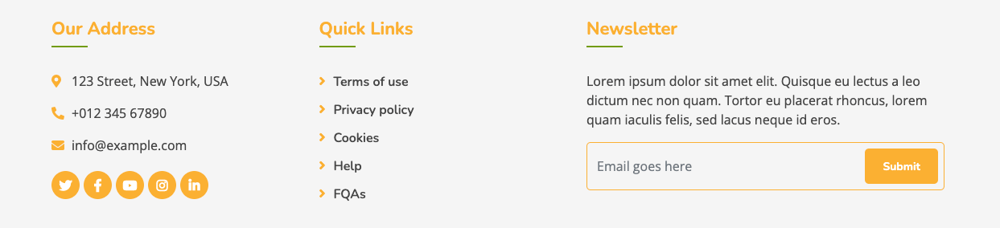

``USER STORY - As a staff user, I want to be able to create a new menu when we have new dishes to offer``

Implementation:

**Create Menu Page**

A create menu page was implemented to allow staff users to create new menus via the UI without having to use the backend admin panel. This will allow staff the ability to quickly update menus when they have made changes to the food being offered.

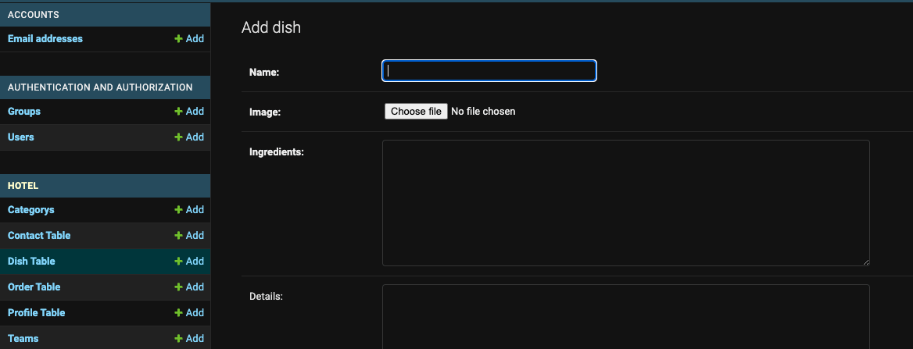

``USER STORY -As a user, I would like to be able to view menus so that I can decide if I would like to dine at the restaurant``

Implementation:

**View Menu Page**

A menu page has been implemented to allow users to see the current active menus and decide whether they are interested in the food we offer before booking. This is visible to all users regardless of logged in state as it is not user friendly to restrict core information from users to force them into signing up.

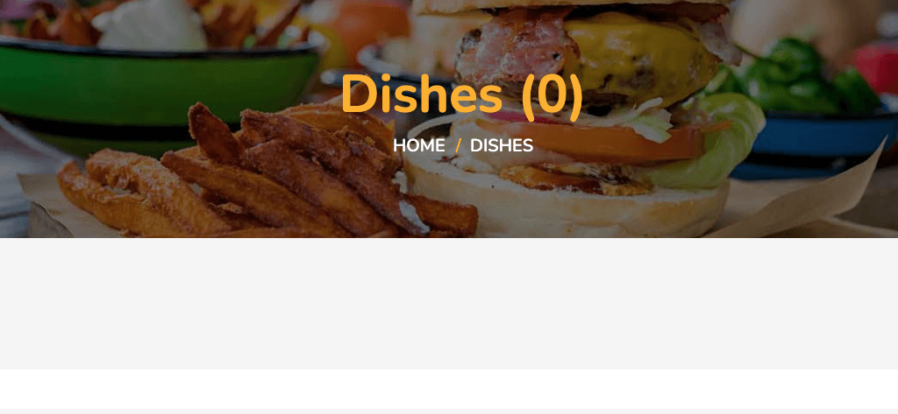

``USER STORY -As a staff user, I want to be able to edit a menu when updates are needed``

Implementation:

**Edit Menu/dish Page**

On the manage menus page a button was added to allow staff members to edit a menu when changes need to be made.

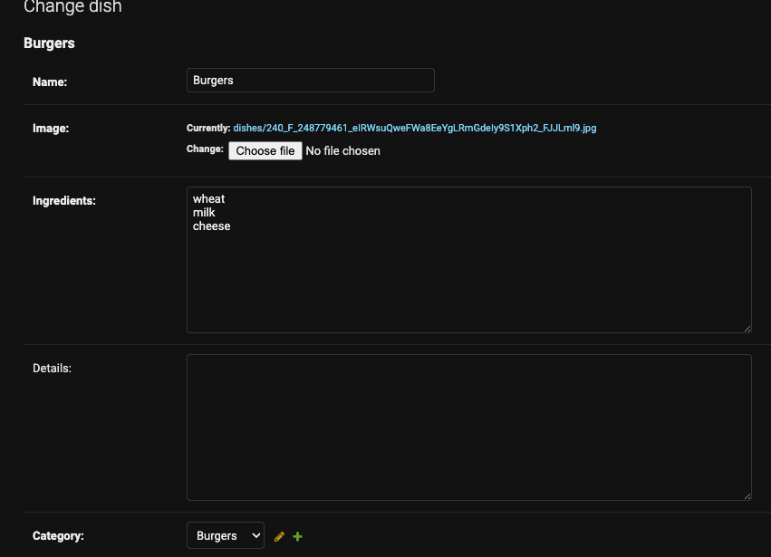


Implementation:

**Menu/Dish**


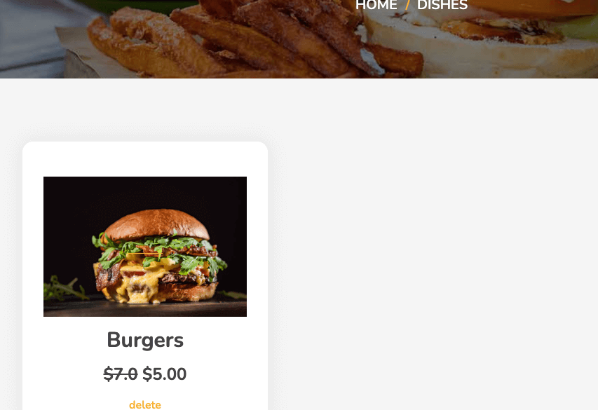

``USER STORY -As a staff user, I want to be able to delete a menu when it is no longer used``

Implementation:

**Delete Menu Page**

On the manage menus page, a delete button has been implemented that will take staff users to a confirmation page to allow them to delete a menu. This will allow staff to delete menus when they are no longer needed

![Delete Menu]

``USER-STORY - As a user, I would like to be able to create a new booking when I want to visit the restaurant``

Implementation:


Favicon
    * A site wide favicon was implemented.
    * This provides an image in the tabs header to allow the user to easily identify the website if they have multiple tabs open.


Implementation:


This covers:

* Create Menu - Only authorized to staff
* Edit Menu - Only authorized to staff
* Delete Menu - Only authorized to staff


Implementation:

**Base Setup User Stories**

The following stories were implemented in order to set up a base structure for all the HTML pages and the core installations and configurations needed to run the application. While these do not show as individual features, they were stories completed that were needed to implement all of the stories above.

``As a developer, I need to create the base.html page and structure so that other pages can reuse the layout``

``As a developer, I need to create static resources so that images, css and javascript work on the website``

``As a developer, I need to set up the project so that it is ready for implementing the core features``

**Favicon**

A favicon was added the website to enable users to easily locate the website in the browser when multiple tabs are open.

### Features Left To Implement
- In a future release I would like to implement a page which displays a table map of the restaurant with information displayed on each table of upcoming bookings. This feature would allow staff to easily see if there are any upcoming bookings on the each table and plan accordingly. 


### Wireframes

- Home page


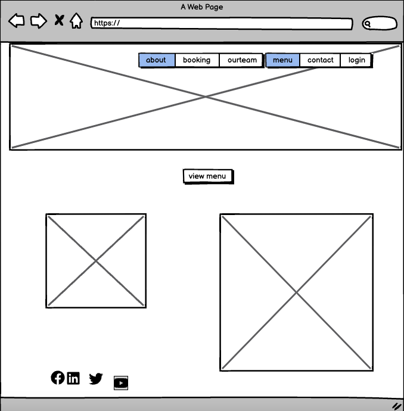
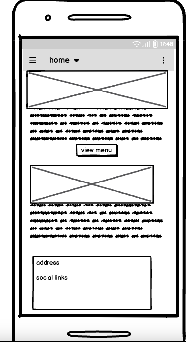


- Signup page


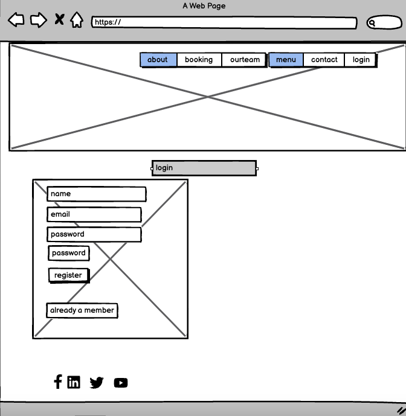
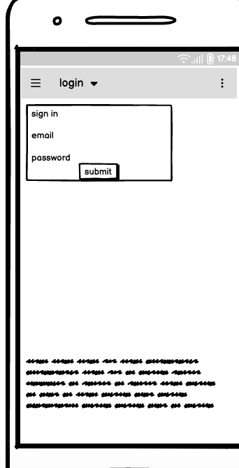

- Log in /  Log Out

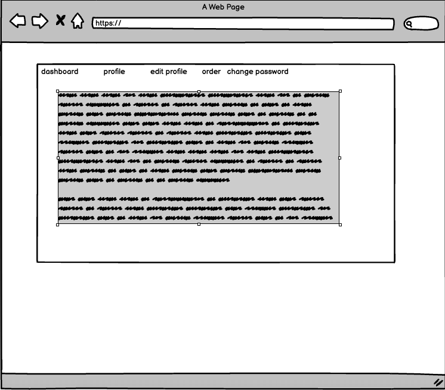
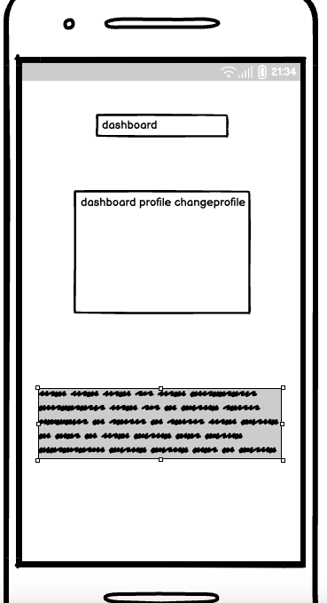


## Technolgies

- HTML
  - The structure of the Website was developed using HTML as the main language.
- CSS
  - The Website was styled using custom CSS in an external file.
- JavaScript
  - JavaScript was used to make the custom slider on the menu page change and the bootstrap date picker.
- Python
  - Python was the main programming language used for the application using the Django Framework.
- Visual Studio Code
  - The website was developed using Visual Studio Code IDE
- GitHub
  - Source code is hosted on GitHub
- Git
  - Used to commit and push code during the development of the Website
- Font Awesome
  - This was used for various icons throughout the site
- Favicon.io
  - favicon files were created at https://favicon.io/favicon-converter/
- balsamiq
  - wireframes were created using balsamiq from https://balsamiq.com/wireframes/desktop/#
- TinyPNG
  - This was used to compress the hero image for optimal load times

**External Python Modules**

* cloudinary==1.29.0 - Cloundinary was set up for use but no custom uploads were made, settings remain for future development
* crispy-bootstrap5==0.6 - This was used to allow bootstrap5 use with crispy forms
* cryptography==37.0.2 - Installed as dependency with another package
* defusedxml==0.7.1 - Installed as dependency with another package
* dj-database-url==0.5.0 - Used to parse database url for production environment
* dj3-cloudinary-storage==0.0.6 - Storage system to work with cloudinary
* Django==4.0.5 - Framework used to build the application
* django-admin-rangefilter==0.8.4 - This was used to search bookings in the admin for a range between 2 dates
* django-allauth==0.51.0 - Used for the sites authentication system, sign up, sign in, logout, password resets ect.
* django-crispy-forms==1.14.0 - Used to style the forms on render
* django-model-utils==4.2.0 - Installed as dependency with another package
* gunicorn==20.1.0 - Installed as dependency with another package
* idna==3.3 - Installed as dependency with another package
* oauthlib==3.2.0 - Installed as dependency with another package
* psycopg2==2.9.3 - Needed for heroku deployment
* pycparser==2.21 - Installed as dependency with another package
* PyJWT==2.4.0 - Installed as dependency with another package
* python3-openid==3.2.0 - Installed as dependency with another package
* requests==2.27.1 - Installed as dependency with another package
* requests-oauthlib==1.3.1 - Installed as dependency with another package (allauth authentication)
* six==1.16.0 - Installed as dependency with another package
* sqlparse==0.4.2 - Installed as dependency with another package
* tzdata==2022.1 - Installed as dependency with another package
* urllib3==1.26.9 - Installed as dependency with another package
* whitenoise==6.2.0 - Used to serve static files directly without use of static resource provider like cloundinary

## Testing

- HTML

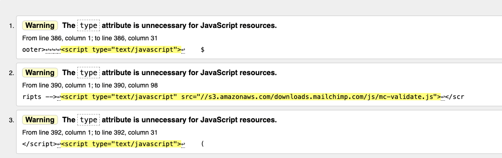

- CSS

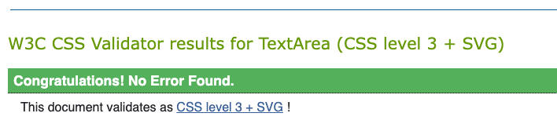

- Add Product

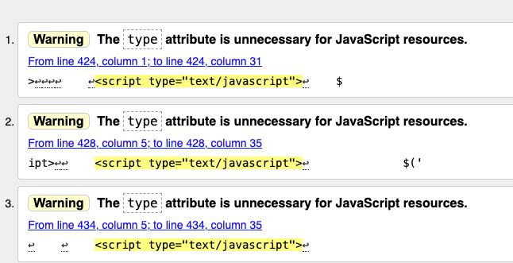

- All HTML pages were checked, and has same warning message


- All models.py, views.py, and forms.py were checked.


## Deployment

### Version Control

The site was created using the Visual Studio Code editor and pushed to github to the remote repository ‘Gars-Steakhouse’.

The following git commands were used throughout development to push code to the remote repo:

```git add <file>``` - This command was used to add the file(s) to the staging area before they are committed.

```git commit -m “commit message”``` - This command was used to commit changes to the local repository queue ready for the final step.

```git push``` - This command was used to push all committed code to the remote repository on github.

### Heroku Deployment

The site was deployed to Heroku. The steps to deploy are as follows:

- Navigate to heroku and create an account
- Click the new button in the top right corner
- Select create new app
- Enter app name
- Select region and click create app
- Click the resources tab and search for Heroku Postgres
- Select hobby dev and continue
- Go to the settings tab and then click reveal config vars
- Add the following config vars:
  - SECRET_KEY: (Your secret key)
  - DATABASE_URL: (This should already exist with add on of postgres)
  - EMAIL_HOST_USER: (email address)
  - EMAIL_HOST_PASS: (email app password)
  - CLOUNDINARY_URL: (cloudinary api url)
- Click the deploy tab
- Scroll down to Connect to GitHub and sign in / authorize when prompted
- In the search box, find the repositoy you want to deploy and click connect
- Scroll down to Manual deploy and choose the main branch
- Click deploy

The app should now be deployed.

The live link can be found here: [Live Site](https://burger-joint2.herokuapp.com/)

### Run Locally

Navigate to the GitHub Repository you want to clone to use locally:

- Click on the code drop down button
- Click on HTTPS
- Copy the repository link to the clipboard
- Open your IDE of choice (git must be installed for the next steps)
- Type git clone copied-git-url into the IDE terminal

The project will now have been cloned on your local machine for use.

### Fork Project

Most commonly, forks are used to either propose changes to someone else's project or to use someone else's project as a starting point for your own idea.

- Navigate to the GitHub Repository you want to fork.

- On the top right of the page under the header, click the fork button.

- This will create a duplicate of the full project in your GitHub Repository.

## Credits 
1. All the images were taken from google


## Special Thanks

special thanks to my mentors Daisy McGirr 

Special thanks to my batch mates from ucd and all the people who helped me directly and indirectly for this project

## Bugs

The background image is not working, 